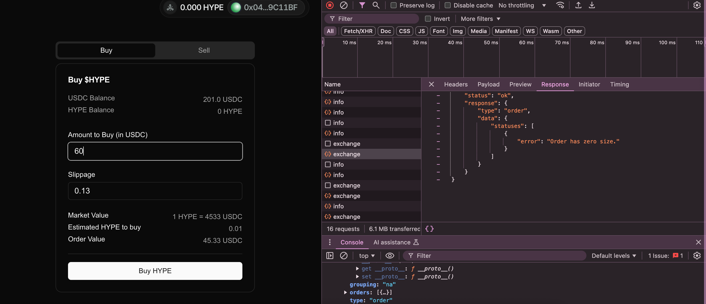

# Sovrun create-builder-codes-dapp boilerplate



A Next.js-based boilerplate for building decentralized spot trading applications on Hyperliquid utilizing [Builder Codes](https://hyperliquid.gitbook.io/hyperliquid-docs/trading/builder-codes). This project provides a foundation for creating web3 trading interfaces with essential features like wallet connection, builder fee approval, agent creation, and gas-free order execution. The sample dapp provided allows for basic swap routing on Hyperliquid L1.

## Features

- 🔐 Secure authentication using Farcaster via Privy
- 💱 Spot trading interface for buying and selling tokens
- 🤝 Builder fee approval system
- 🔑 Agent-based trading system
- 🎨 Modern UI using shadcn/ui components
- 🌙 Dark mode support
- 🔄 Real-time price and balance updates
- 🎭 Farcaster profile integration

## Tech Stack

- **Framework**: Next.js 15
- **Language**: TypeScript
- **Styling**: Tailwind CSS
- **Authentication**: Privy (Farcaster integration)
- **Web3**:
  - Wagmi
  - Viem
  - Ethers.js
- **State Management**: Zustand
- **Data Fetching**: TanStack Query
- **UI Components**: shadcn/ui
- **Package Manager**: pnpm

## Getting Started

1. Clone the repository
2. Install dependencies:

```bash
pnpm install
```

3. Set up environment variables:

```env
# Privy App ID (get from https://dashboard.privy.io/apps)
NEXT_PUBLIC_PRIVY_APP_ID=your_privy_app_id_here

# The environment mode (development/production)
NEXT_PUBLIC_NODE_ENV=development

# The RPC URL for connecting to the Hyperliquid testnet
NEXT_PUBLIC_RPC_URL=your_rpc_url

# The builder's wallet address for fee collection
NEXT_PUBLIC_BUILDER_ADDRESS=your_builder_address

# The builder fee percentage (in basis points)
NEXT_PUBLIC_BUILDER_FEE=10

# WalletConnect Project ID (optional, for fallback wallet connections)
NEXT_PUBLIC_PROJECT_ID=your_walletconnect_project_id
```

4. Run the development server:

```bash
pnpm dev
```

## Core Components

### Farcaster Authentication

The authentication is handled through Privy's Farcaster integration, providing:

- **Sign in with Farcaster**: Users authenticate using their Farcaster account
- **Embedded Wallets**: Automatic wallet creation for users without existing wallets
- **Profile Integration**: Display Farcaster profile information including username, bio, and follower counts
- **Secure Authentication**: Leverages Farcaster's decentralized identity system

### Trading Interface

The trading interface supports both buying and selling with features like:

- Current token price
- Balance checking
- Slippage control
- Order execution

### Builder Fee Approval

Users need to approve builder fees before trading.

### Agent System

The platform uses an agent-based system for gas-free trading.

## Contributing

Contributions are welcome! Guidelines currently being drafted, please feel free to coordinate with us for reviewing PRs.

## License

This project is licensed under the MIT License - see the LICENSE file for details.

## Support

For support, please open an issue in the GitHub repository, reach out to the Hyperliquid community, or visit the Sovrun discord.
